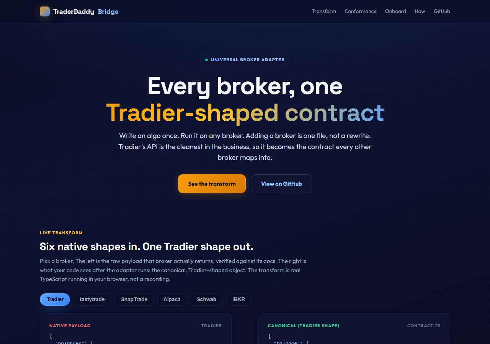
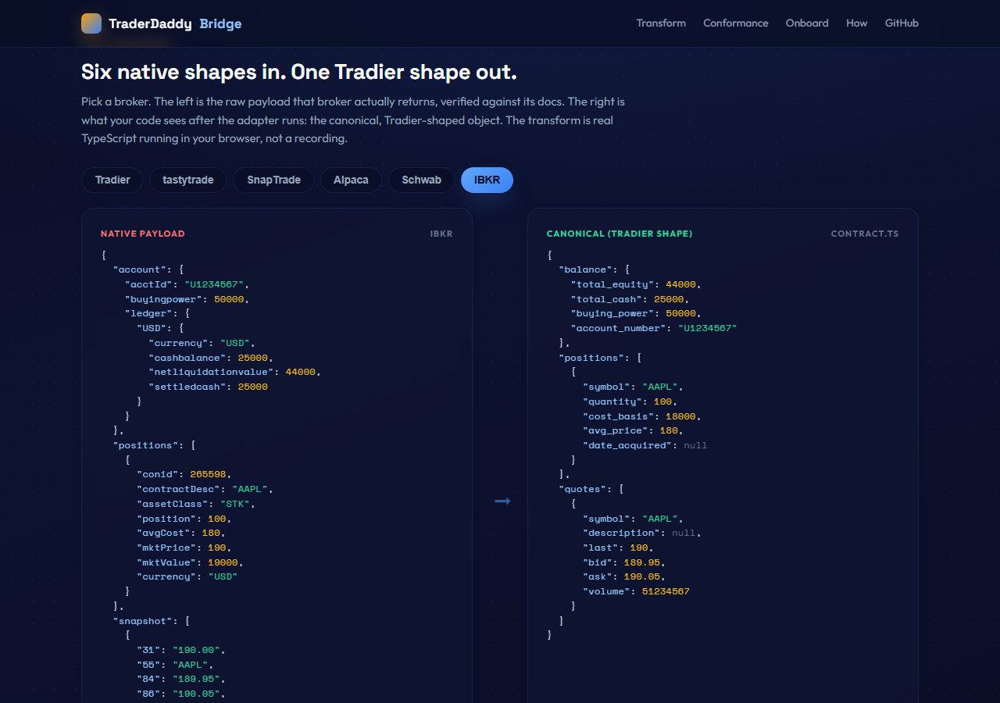
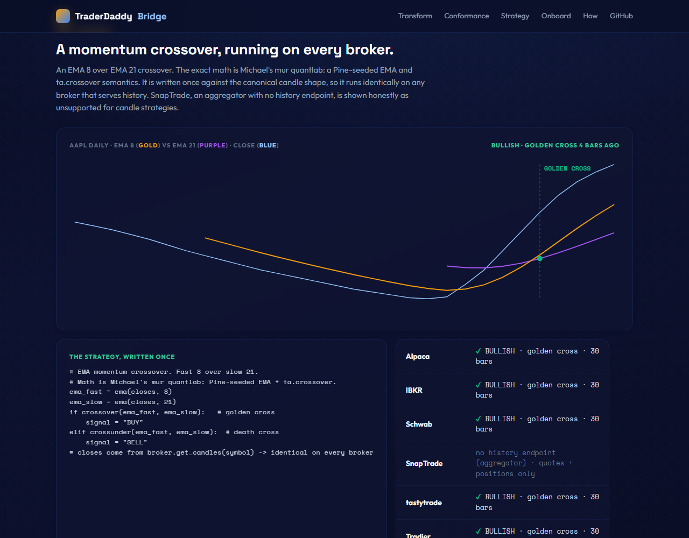
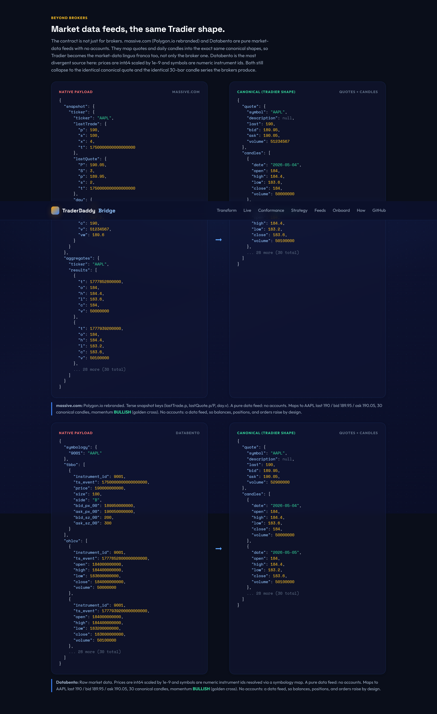
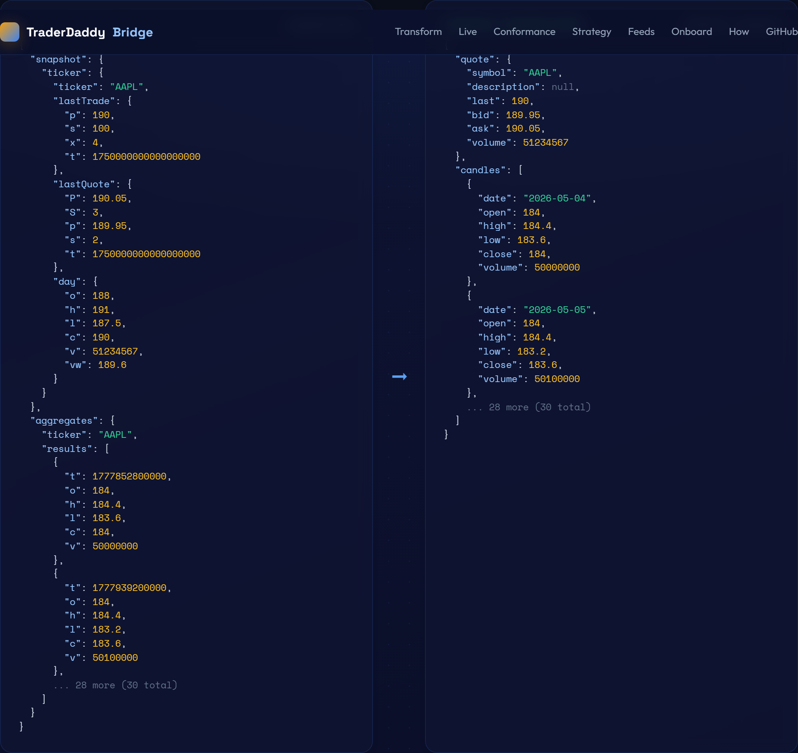
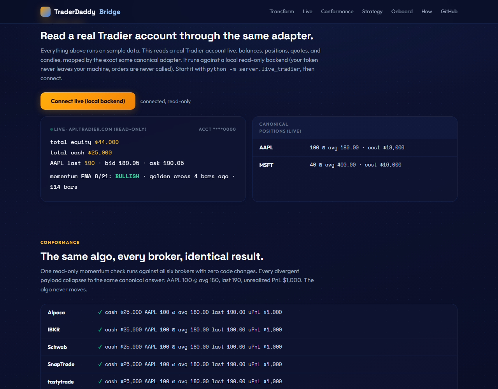

# TraderDaddy Bridge

**Every broker, one Tradier-shaped contract. Write an algo once, run it on any broker. Adding a broker is one file, not a rewrite.**

A universal broker adapter for US equities and options. Tradier's API is the cleanest in the business, so it becomes the canonical contract that every other broker maps INTO. Write your strategy once against the Tradier shape and it runs unchanged on tastytrade, Schwab, Alpaca, SnapTrade, and IBKR.

**Live demo:** https://mphinance.github.io/traderdaddy-bridge/



## The thesis

Six brokers return wildly different payloads for the same account. Every one of them maps into Tradier's shape through a thin adapter, and downstream nothing knows the difference.



- **Tradier** clean flat JSON, the reference shape
- **tastytrade** hyphenated keys, string numbers, direction word, quotes over a DXLink WebSocket
- **SnapTrade** aggregator, ticker nested three deep, no volume on quotes
- **Alpaca** every number a string, snapshot quotes with one-letter keys
- **Schwab** everything under `securitiesAccount`, size split across long/short quantity
- **IBKR** ledger keyed by currency, market data by numeric field code (31=last, 84=bid)

Pick a broker on the live demo and watch its raw payload collapse into the canonical object in real time. The transform is real TypeScript running in your browser, not a recording.

## A real strategy, running on every broker

An EMA 8 over EMA 21 momentum crossover. The math is Michael's mur quantlab: a Pine-seeded EMA and `ta.crossover` semantics. It is written once against the canonical candle shape, so it runs identically on any broker that serves history. SnapTrade, an aggregator with no history endpoint, is shown honestly as unsupported for candle strategies.



The contract covers balances, positions, quotes, AND daily candles. All of them normalize across brokers, so the strategy produces the same golden cross on Tradier, tastytrade, Schwab, Alpaca, and IBKR.

## Beyond brokers: market data feeds

The contract is clean enough that pure market-data vendors map into it too, not just brokers. **massive.com** (Polygon.io rebranded) and **databento** have no accounts, so they raise on balances/positions/orders and map only the market side: quotes, daily candles, and option chains (with Greeks where the feed carries them, `None` where it does not, as with Databento's raw market data). The point flows toward Tradier: its quote, candle, and chain shapes become the common vocabulary every data vendor speaks INTO. Tradier is the market-data lingua franca, not only the broker one, so any app coding against Tradier's shape can pull from any feed underneath without changing a line. The two feeds produce the identical 30-bar candle series and the identical AAPL 190 call as the brokers do.



*Both feeds: native payload on the left, the canonical Tradier-shaped quote and candles on the right. They collapse to the same result the brokers do.*

A closer look at **massive.com** (Polygon.io rebranded), its native snapshot plus daily aggregates mapped into the canonical quote and candle series:



## Live, read-only

The demo above runs on sample data. The Live panel reads a **real Tradier account** through the exact same canonical adapter: balances, positions, quotes, and candles, with the momentum signal computed on real history.



It runs against a small **local, read-only backend** (`server/app.py`). Your token is read from the environment at runtime, never enters git, and the backend calls only Tradier read endpoints. `place_order` stays preview-only. The same process also serves the universal MCP server at `/mcp`. See [server/README.md](server/README.md).

```bash
# terminal 1: the backend (read snapshot + universal MCP), from repo root
pip install -e .   # one time: fastapi + uvicorn + fastmcp
BRIDGE_SECRETS=/path/to/secrets.env python -m server.app
# terminal 2: the web app, served locally so it can reach localhost
cd web && npm run dev
# open the local app, scroll to Live, click Connect
```

(The hosted Pages site is the shareable demo; live mode is local-only, since browsers block an https page from calling http://localhost.)

## Why Tradier-shaped, not neutral

Other unified APIs (OpenAlgo for India, ccxt for crypto) map brokers into a deliberately neutral schema. This one does the opposite on purpose: it favors Tradier. When other brokers' users adopt Tradier-native tooling, they migrate toward Tradier. Tradier becomes the lingua franca, the API every developer learns first. That is the whole point. It is a business thesis, not a neutral utility.

## What is in here

```
traderdaddy-bridge/
  engine/        Python reference engine (the canonical contract + 6 adapters + tests). Pure stdlib.
  web/           Vite + TypeScript live demo (deployed to GitHub Pages)
  mcp_server/    universal MCP server: Tradier-MCP vocabulary on any broker (FastMCP, stdio + HTTP)
  server/        FastAPI app: read-only Tradier snapshot + the MCP server over HTTP, one process
  docs/          screenshots + ingested Tradier-MCP reference
```

### The Python engine
The source of truth. Canonical contract, six broker adapters plus two market-data feeds (massive.com, databento), conformance tests, and two convert demos.

```bash
# from the repo root
python -m engine.demo_algo              # one algo, six brokers, then two data feeds
python -m engine.strategy               # EMA crossover, same signal every broker
python -m engine.convert_onboarding     # five traders, five SDKs, all onboarded
python engine/tests/test_conformance.py # 9/9: balances, positions, quotes, candles, chains
```

### The web demo
The interactive, deployable face of it. The six broker adapters plus the two data feeds are ported to TypeScript and run client-side, so the transform you see is genuinely executing.

```bash
cd web
npm install
npm run dev        # local dev server
npm run build      # static build into web/dist
```

## Adding a broker

1. Write one adapter mapping the broker's native responses into the contract (`engine/adapters/<broker>.py` and `web/src/adapters/index.ts`).
2. Register it.
3. Every existing algo now runs on that broker.

## The agentic angle

Tradier ships an MCP server whose tools are shaped like its API, the exact shapes this layer targets. So the canonical layer makes a Tradier-shaped MCP broker-agnostic for free. Every algo written for Tradier runs on any broker (developer acquisition), and every agent speaking Tradier-MCP runs on any broker (the agentic-trading wave). One tool vocabulary, every broker.

This is real, not just a thesis. **[`mcp_server/`](mcp_server/README.md) is a universal MCP server**, built on FastMCP: it exposes the Tradier-MCP tool vocabulary once (`get_balances`, `get_quotes`, `get_history`, `get_option_chain`, `place_order`) and routes every call through the canonical adapters. Point an MCP agent at it, ask for AAPL quotes, switch `BRIDGE_BROKER`, and ask again. The answer comes back in the identical shape on Tradier, tastytrade, Schwab, Alpaca, IBKR, or a pure data feed.

One FastMCP definition, two transports: **stdio** for local Claude Code (`claude mcp add traderdaddy -- python -m mcp_server.universal`) and **HTTP/SSE** for hosting, served at `/mcp` by the same FastAPI process as the read backend (`python -m server.app`), the way Tradier ships its own MCP over HTTP. The ingested Tradier-MCP reference lives in [`docs/tradier-mcp.md`](docs/tradier-mcp.md). `place_order` previews by design.

## Honest status

The canonical contract, all six adapters, the conformance tests, and every transform in the demo are real and run on sample payloads verified against each broker's official docs and SDK. **Tradier live read is wired** through the local read-only backend in `server/` (real balances, positions, quotes, candles, and the momentum signal on real history). Live read for the other five brokers is the next step (same pattern: each adapter gets a base URL + token and real REST calls). The hosted site stays demo-only; live mode runs locally so no token or real account is ever exposed.

Reads are the universal surface. Order placement previews by design. Live execution is opt-in per adapter and never automatic. No money moves without a human.

## License

MIT. Permissive on purpose: this is meant to be adopted, including by Tradier.
